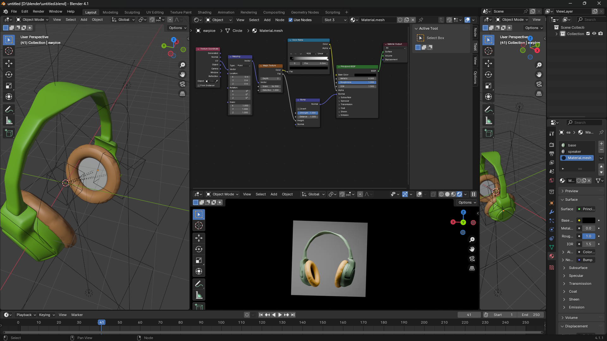

# 🎧 Headphones 3D Model — Blender Project

A detailed 3D model of over-ear headphones created in **Blender 4.1**, featuring custom materials, procedural textures, and PBR shading.

---

## 📸 Preview

<!-- Replace with your actual render image -->


---

## 🛠️ Project Details

| Property | Details |
|----------|---------|
| **Software** | Blender 4.1 |
| **File** | `untitled.blend` |
| **Render Engine** | Cycles |
| **Shading** | Principled BSDF (PBR) |

---

## 🎨 Materials

The model uses three custom materials:

- **`base`** — Main headband and frame structure (green matte finish)
- **`speaker`** — Speaker driver and grille details
- **`Material.mesh`** — Ear cushion mesh with procedural texture using Magic Texture + Bump nodes

### Shader Setup
The ear cushion material uses a node-based shader with:
- **Texture Coordinate** → **Mapping** → **Magic Texture** for procedural surface detail
- **Bump** node for surface normal variation
- **Principled BSDF** for physically-based rendering

---

## 📁 File Structure

```
📦 blender-headphones/
 ┣ 📄 untitled.blend      # Main Blender project file
 ┣ 📄 README.md           # This file
 ┗ 📄 .gitignore          # Excludes temp files
```

---

## 🚀 Getting Started

1. **Clone the repository:**
   ```bash
   git clone https://github.com/YOUR_USERNAME/YOUR_REPO_NAME.git
   ```

2. **Open in Blender:**
   - Launch Blender 4.1 or later
   - Go to `File → Open` and select `untitled.blend`

3. **Render the scene:**
   - Press `F12` to render, or go to `Render → Render Image`

---

## ⚙️ Requirements

- [Blender 4.1+](https://www.blender.org/download/) (free & open source)

---

## 📌 Notes

- The project uses only Blender's built-in procedural textures — no external texture files needed.
- Render settings may need adjustment depending on your hardware (GPU vs CPU rendering).

---

## 🙏 Credits

This project was made following this amazing tutorial:

> 📺 **[Product Design in Blender: Headphones [Full Process]](https://youtu.be/p2iloupX7S8?si=Gfft859pEPVeHKPe)** by **Derek Elliott**

Big thanks for the clear and detailed walkthrough — highly recommend it to anyone learning product design in Blender!

---

## 📄 License

This project is for personal/educational use. Feel free to use it as a learning reference.

---

*Made with ❤️ in Blender*
